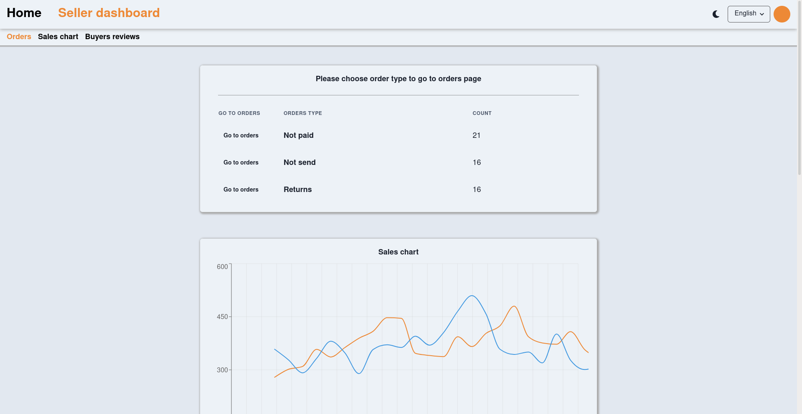
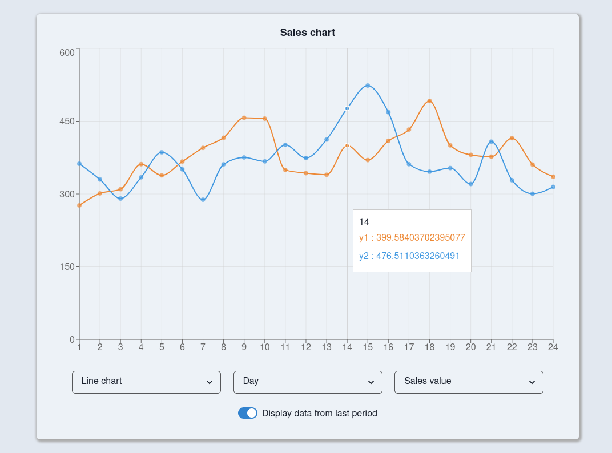
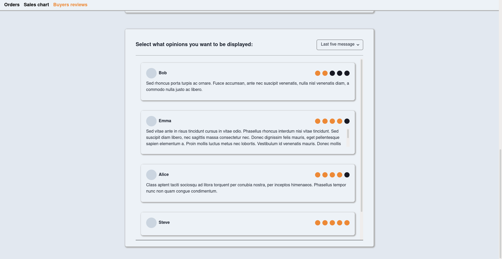
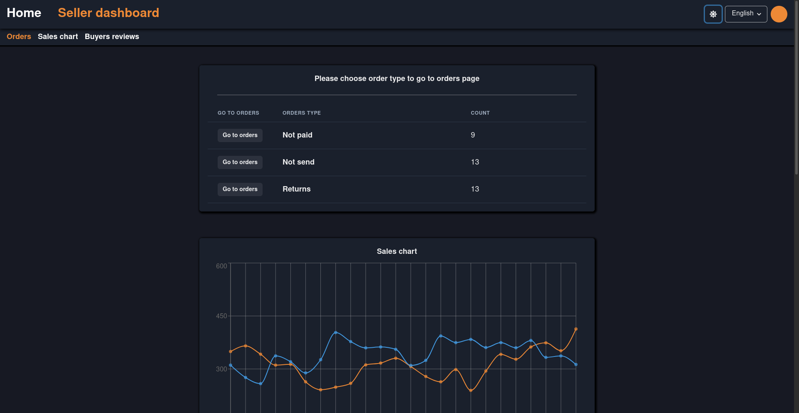
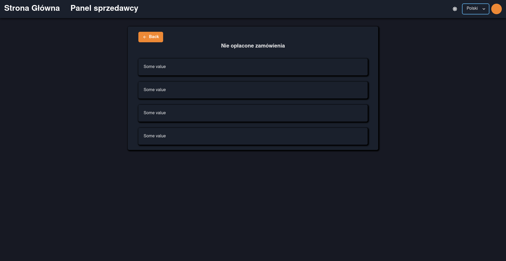

# This is project for frontend of seller dashboard
Frontend made with React, Typescript and ChakraUI. Backend mocked using python and flask.

Application features:
- spa - no page reloading
- many widgets presenting data in multiple ways
- light and dark mode
- 2 languages (EN/PL)

# App presentation

# How to build & run
## Prerequisites:
<ul>
    <li>installed python3</li>
    <li>installed node with npm</li>
</ul>
<h2>Backend part</h2>

<ul>
    <li>Enter project main directory</li>
    <li>pip install -U Flask</li>
    <li>cd backend-mock</li>
    <li>flask run</li>
</ul>

<h2>Fronted part</h2>
<ul>
    <li>Enter project main directory</li>
    <li>npm install</li>
    <li>npm run start</li>
</ul>

## App should be running now and you should have access to it at 
http://localhost:3000

### To login into seller account you don't have to enter any credentials just click login!
